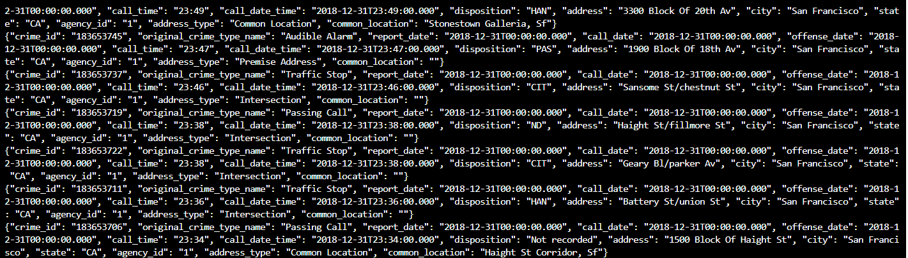
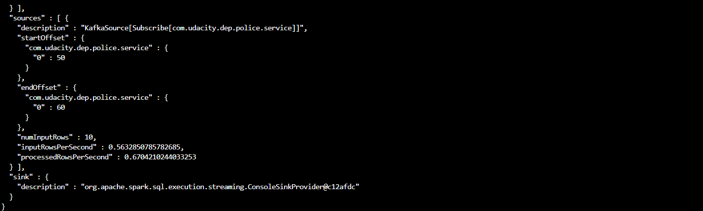

## SF Crime Statistics with Spark Streaming 

### A screenshot of your kafka-consumer-console output

### A screenshot of your progress reporter after executing a Spark job

**Question 1. How did changing values on the SparkSession property parameters affect the throughput and latency of the data?**

I investigated the parameter `processedRowsPerSecond`. The parameter will affect the number of rows we can process per second, which indicates higher throughput and smaller latency. We can also change the parameter `inputRowsPerSecond` to affect the throughput.

**Question 2. What were the 2-3 most efficient SparkSession property key/value pairs? Through testing multiple variations on values, how can you tell these were the most optimal?**

Take the parameter `processedRowsPerSecond` as our example, to maximize the `processedRowsPerSecond` we should find the best `spark.default.parallelism`, `spark.streaming.kafka.maxRatePerPartition`,`spark.streaming.backpressure.enabled`, and `spark.sql.shuffle.partitions`.

They will further depend on the data size and the machine we use. We give two examples of tunning the parameters.  For example, `spark.default.parallelism` should depend on how many machines and cores we have. For examples, if we have 3 quad-core machines, it is reasonable to set `spark.default.parallelism` into `36` since only 3 tasks per core. However, it is not reasonable to give too large values if you only have small number of cores. The `spark.streaming.kafka.maxRatePerPartition` can make sure that the stream process running stable and efficient. It corresponds to the maximum rate for each partition. We should set it to be the largest number of unprocessed messages at the peak to prevent the broken of the whole process. 
